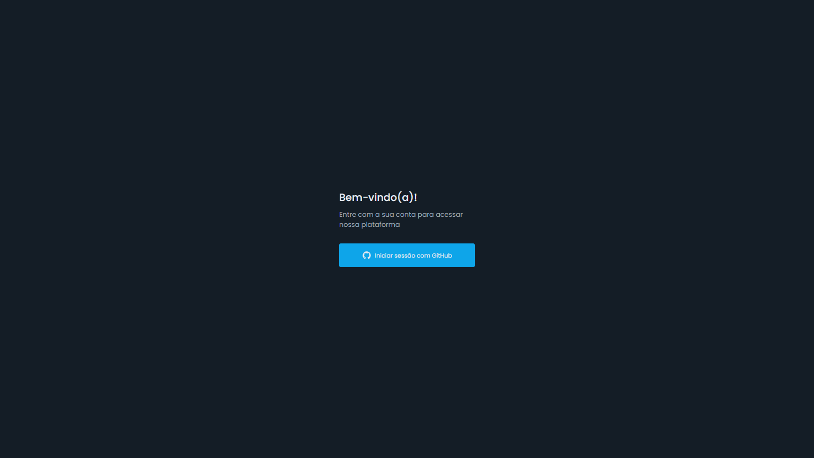
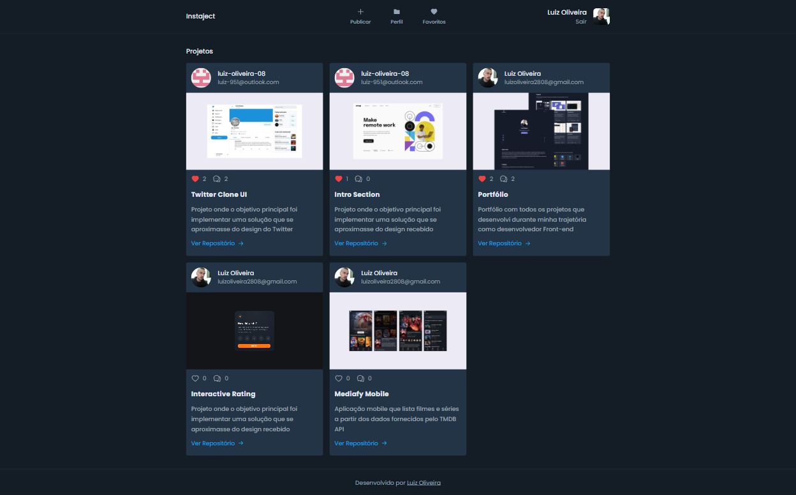
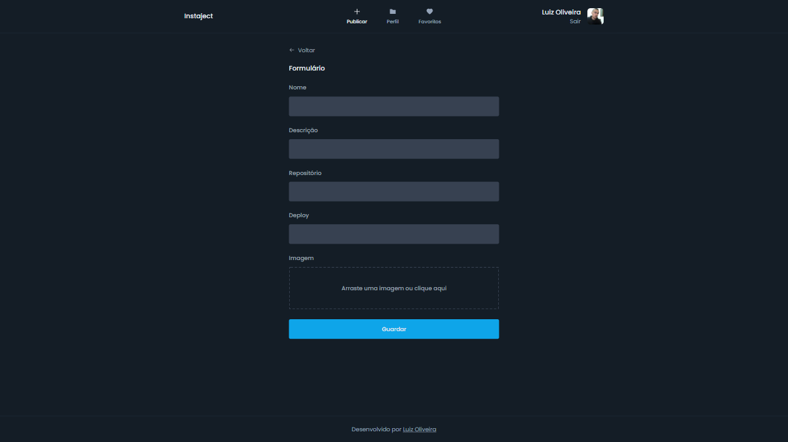
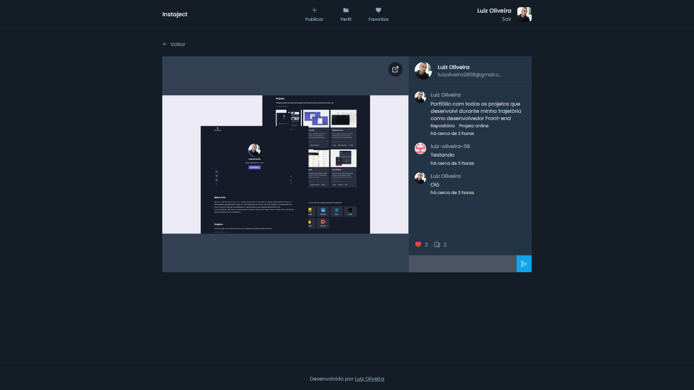

### Instaject

Iniciei esse projeto para por em prática meus conhecimentos em Next.js, TailwindCSS e Firebase, além disso, ao longo de seu desenvolvimento fui acrescentando alguns desafios extras, como upload de imagens, informações em tempo real e validação de formulário.

Como resultado, cheguei em uma aplicação que permite que o usuário faça publicações de seus projetos, veja publicações de outros usuários, faça comentários em publicações, adicione publicações a sua lista de favoritos e faça login na aplicação com uma conta do GitHub.

Veja o resultado clicando <b><a href="https://instaject.vercel.app/" target="_blank">aqui</a></b>

### Funcionalidades
- Publicar, editar e excluir projetos
- Ver projetos de outros usuários
- Adicionar e excluir comentários em projetos
- Realizar login com uma conta do GitHub
- Realizar sign out

### Imagens do projeto

##### Página de Sign In

##### Publicações de projetos

##### Formulário para publicar um projeto

##### Publicação com comentários

### Tecnologias
- Next.js
- Next Auth
- Firestore
- TypeScript
- React Hook Form
- TailwindCSS
- React Dropzone
- React Toastify
- React Loading
- React Icons
- Axios
- ImgBB
- GitHub OAuth
